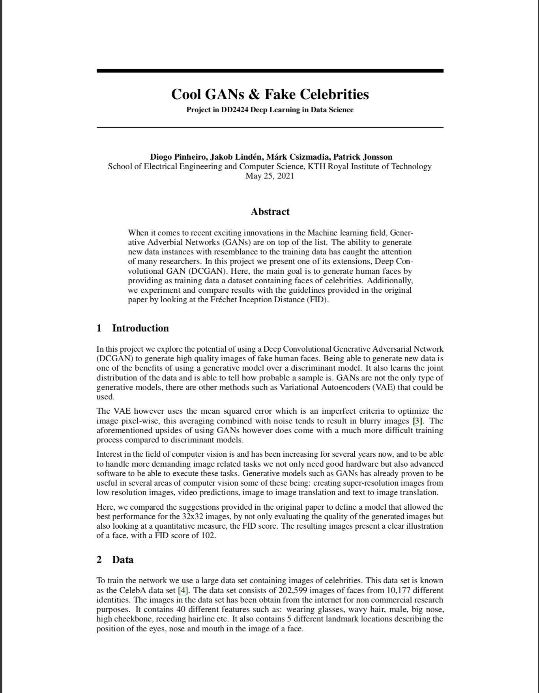

# Cool GANs and Fake Celebrities
Final project for DD2424 Deep Learning in Data Science at the KTH Royal Institute of Technology, Stockholm.

Create fake human faces with DCGANs. Evaluation performed using Fréchet Inception Distance (FID).

## Group Members
  - Diogo Pinheiro (https://github.com/DiogorPinheiro)
  - Jakob Lindén (https://github.com/jakobGTO)
  - Márk Csizmadia (https://github.com/mark-antal-csizmadia)
  - Patrick Jonsson (https://github.com/hiver-py)

## Report
[](report/report.pdf)


## Data

Download the data sets either from [original source](http://mmlab.ie.cuhk.edu.hk/projects/CelebA.html) or [Kaggle](https://www.kaggle.com/jessicali9530/celeba-dataset), then extract the images (cropped and aligned) to ```data/celebA/```.

## Final Result

### Best Model 
V
    - Learning Rate: 1e-4
    - Beta1 : 0.5
    - Batch Size : 128
    - Leaky ReLU in both discriminator and generator

### 32x32


### 64x64


## Tools
 - TensorFlow
 - Google Collab

## References
[1] Alec Radford, Luke Metz, and Soumith Chintala.  Unsupervised representation learning withdeep convolutional generative adversarial networks, 2016

